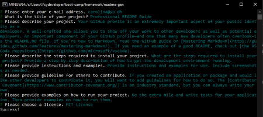
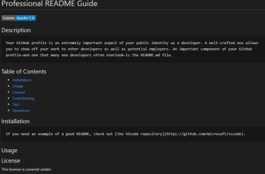

# Professional README Generator

## Description 

This application generates README.md file using command-line application that runs with Node.js.  It guides user through prompts of questions and options and based on user's input, it dynamically generates a markdown file which in this application defaulted to sampleREADME.md.  

## Installation
### Steps required:
In the terminal mode, user must first run __npm install__ to have its package dependecies. Then, user can run the index.js file in Node environment by running __node index.js__.

## Usage 
### Demo of README generator:

### Steps
* User is presented with a series of questions. 
* 
* Then a sampleREADME.md file is generated with the following preview:
* 

## License
 

## MAINTAINER 
This is an individual assignment created by Carolina Yoedhana.
* GitHub Link: https://github.com/CarolinaYo/readme-gen.git

